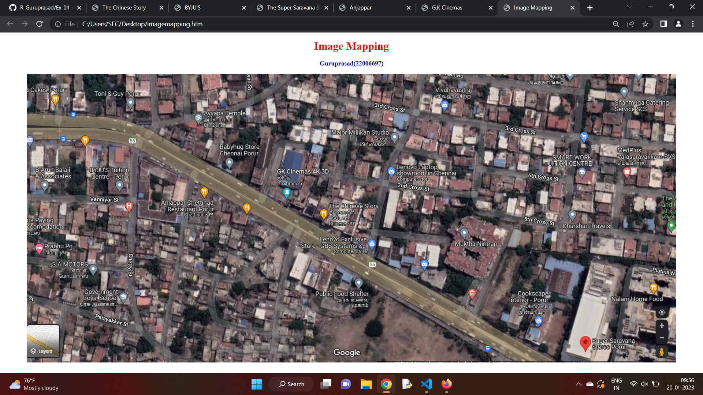
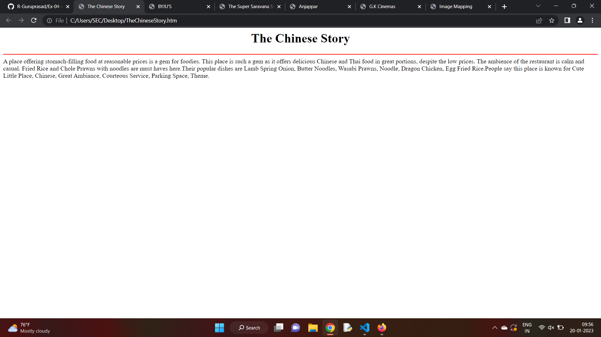
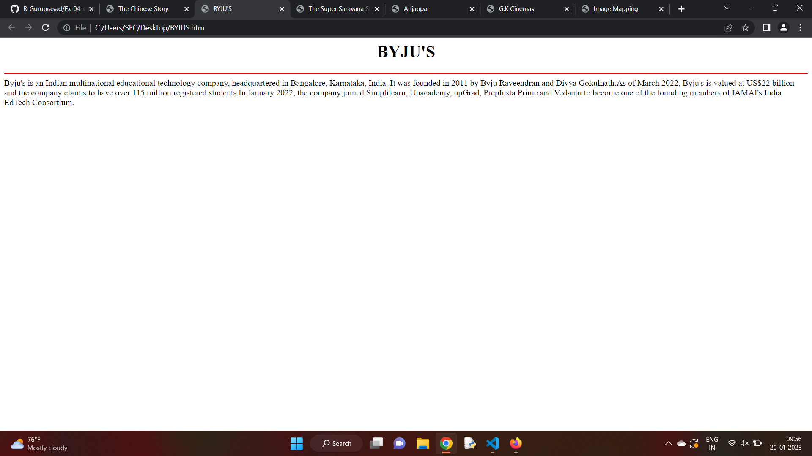
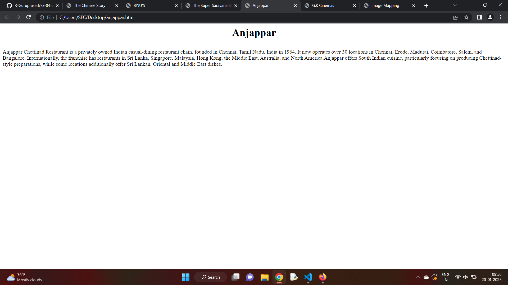
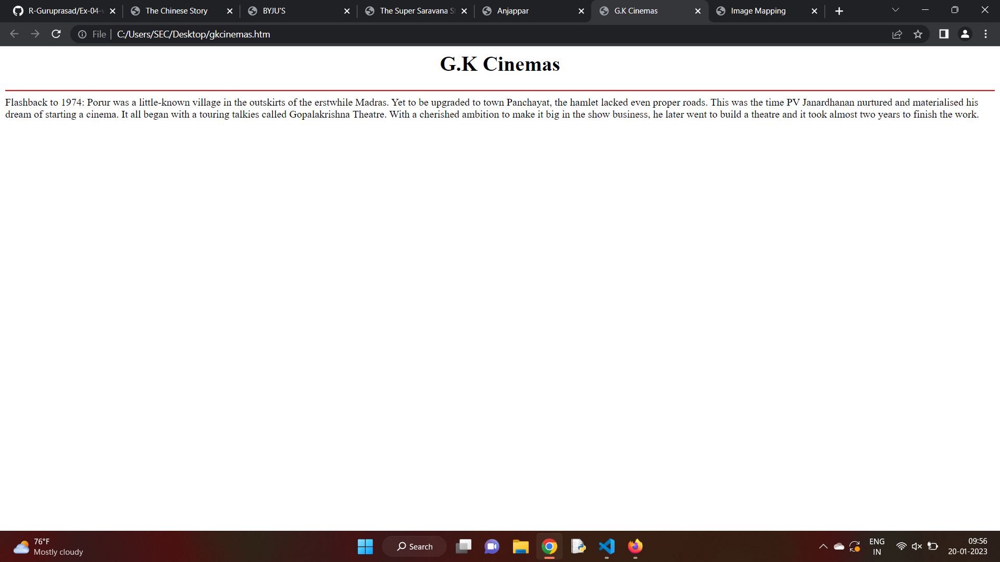

# Places Around Me
# Aim:
To develop a website to display details about the places around my house.

# Design Steps:
## Step 1
clone the GitHUB repository.
## Step 2
Create a new Django Project.
## Step 3
Write the neede HTML code.
## step 4
Run the Django project and Execute the HTML files
# Code:
``` html
imagemapping.htm :

<!DOCTYPE html>
<html lang="en">
<head>
<title>Image Mapping</title>
</head>
<body>
<h1 align="center">
<font color="red"><b>Image Mapping</b></font>
</h1>
<h3 align="center">
<font color="blue"><b>Guruprasad(22006697)</b></font>
</h3>
<center>
    

    <map name="image-map">
        <area target="_blank" alt="" title="" href="TheChineseStory.htm" coords="1032,494,851,319" shape="rect">
        <area target="_blank" alt="" title="" href="BYJUS.htm" coords="159,190,318,364" shape="rect">
        <area target="_blank" alt="" title="" href="sstores.htm" coords="1527,524,1744,832" shape="rect">
        <area target="_blank" alt="" title="" href="anjappar.htm" coords="385,259,567,444" shape="rect">
        <area target="_blank" alt="" title="" href="gkcinemas.htm" coords="683,152,853,406" shape="rect">
    </map>
</center>
</body>
</html>

TheChineseStory.htm :

<html>
    <head>
        <title>The Chinese Story</title>
    </head>
    <body>
        <h1 align="center">The Chinese Story</h1>
        <hr color="red">
        A place offering stomach-filling food at reasonable prices is a gem for foodies.
        This place is such a gem as it offers delicious Chinese and Thai food in great 
        portions, despite the low prices. 
        The ambience of the restaurant is calm and casual. Fried Rice and Chole Prawns with 
        noodles are must haves here.Their popular dishes are 
        Lamb Spring Onion, Butter Noodles, Wasabi Prawns, Noodle, Dragon Chicken, Egg Fried 
        Rice.People say this place is known for
        Cute Little Place, Chinese, Great Ambiance, Courteous Service, Parking Space, Theme.

    </body>
    </html>

    BYJUS.htm :

    <html>
    <head>
        <title>BYJU'S</title>
    </head>
    <body>
        <h1 align="center">BYJU'S</h1>
        <hr color="red">
        Byju's is an Indian multinational educational technology company, headquartered in Bangalore, Karnataka, India. It was founded in 2011 by Byju Raveendran and Divya Gokulnath.As of March 2022, Byju's is valued at US$22 billion and the company claims to have over 115 million registered students.In January 2022, the company joined Simplilearn, Unacademy, upGrad, PrepInsta Prime and Vedantu to become one of the founding members of IAMAI's India EdTech Consortium.

    </body>
    </html>

    sstored.htm :

    <html>
    <head>
        <title>The Super Saravana Stores</title>
    </head>
    <body>
        <h1 align="center">The Super Saravana Stores</h1>
        <hr color="red">
        The story of serving customers by providing them with what they want at an unbelievably affordable price started as a small textile shop on 45, Ranganathan Street, Since 1969, now it is a textile showroom par excellence that the whole of Chennai can be proud of. A success story made from hard work, sound business practices, and dynamism, guided by a management vision. By the continuing patronage of people, Saravana Stores is now a fantasy land of shopping located at T. Nagar, Purasawalkam, Chrompet, and Porur.
        
    </body>
    </html>

    anjappar.htm :

    <html>
    <head>
        <title>Anjappar</title>
    </head>
    <body>
        <h1 align="center">Anjappar</h1>
        <hr color="red">
        Anjappar Chettinad Restaurant is a privately owned Indian casual-dining restaurant chain, founded in Chennai, Tamil Nadu, India in 1964. It now operates over 30 locations in Chennai, Erode, Madurai, Coimbatore, Salem, and Bangalore. Internationally, the franchise has restaurants in Sri Lanka, Singapore, Malaysia, Hong Kong, the Middle East, Australia, and North America.Anjappar offers South Indian cuisine, particularly focusing on producing Chettinad-style preparations, while some locations additionally offer Sri Lankan, Oriental and Middle East dishes.
        
    </body>
    </html>

    gkcinemas.htm :

    <html>
    <head>
        <title>G.K Cinemas</title>
    </head>
    <body>
        <h1 align="center">G.K Cinemas</h1>
        <hr color="red">
        Flashback to 1974: Porur was a little-known village in the outskirts of the erstwhile Madras. Yet to be upgraded to town Panchayat, the hamlet lacked even proper roads. This was the time PV Janardhanan nurtured and materialised his dream of starting a cinema. It all began with a touring talkies called Gopalakrishna Theatre. With a cherished ambition to make it big in the show business, he later went to build a theatre and it took almost two years to finish the work. 
        
    </body>
    </html>

```
# Output:







# Result:
The program for implementing image map is executed.


